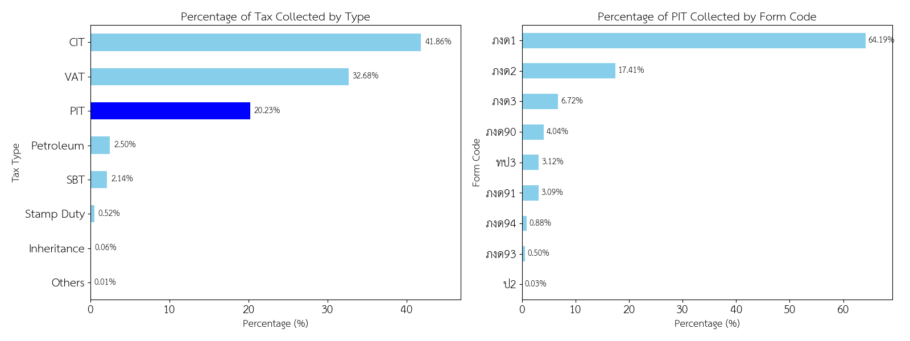
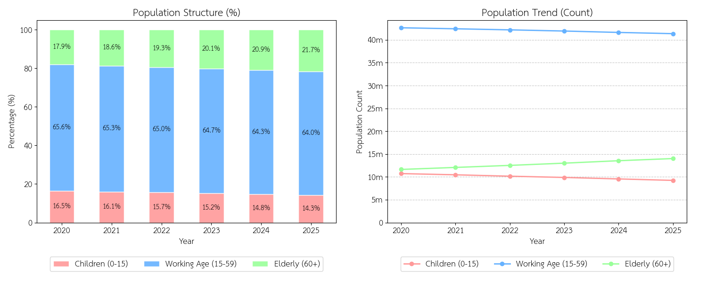
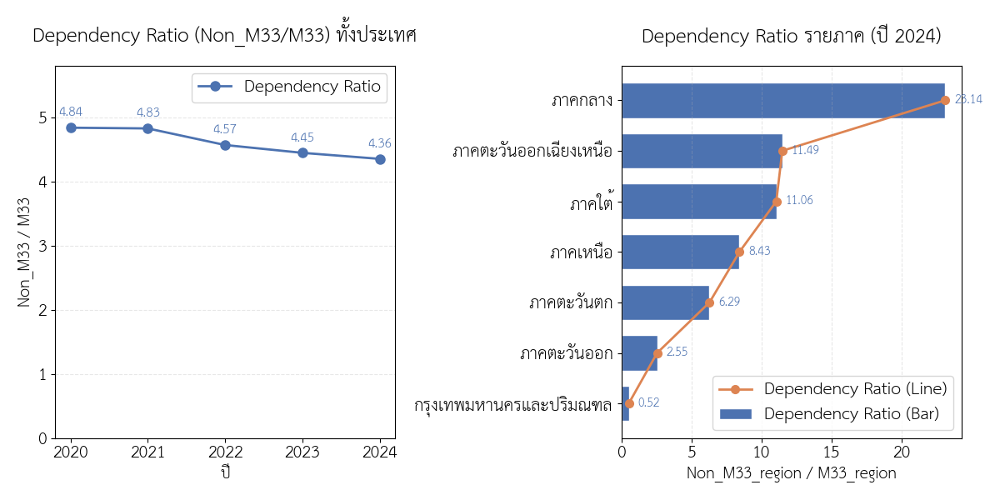
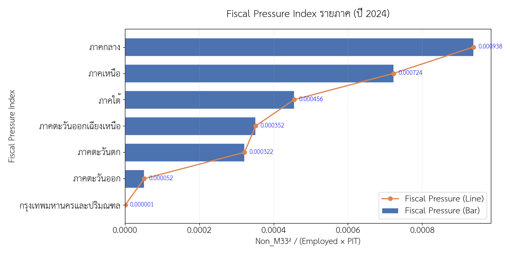

# รายงานวิเคราะห์โครงสร้างภาษีของประเทศไทย: ใครคือผู้แบกรับภาระที่แท้จริง?

ทุกการขับเคลื่อนของประเทศล้วนต้องอาศัยงบประมาณจาก "ภาษี" ไม่ว่าจะเป็นการบริโภคที่ขับเคลื่อนผ่านภาษีมูลค่าเพิ่ม (VAT) หรือการดำเนินธุรกิจที่ขับเคลื่อนผ่านภาษีเงินได้นิติบุคคล (CIT) อย่างไรก็ตาม คำถามสำคัญในเชิงเศรษฐศาสตร์การเมืองและโครงสร้างสังคมคือ **"ใครคือกลุ่มคนที่กำลังแบกรับรายได้หลักของประเทศนี้อยู่อย่างแท้จริง?"**

รายงานการวิเคราะห์ฉบับนี้ มุ่งเน้นไปที่การเจาะลึกข้อมูลการจัดเก็บภาษีของกรมสรรพากร เพื่อทำความเข้าใจ **ภาระภาษี (Tax Burden)** ที่เกิดขึ้นจริงในระบบเศรษฐกิจไทย โดยอ้างอิงจากการวิเคราะห์ชุดข้อมูลเชิงสถิติ

---

## ภาพรวมโครงสร้างรายได้ภาษี

เมื่อมองจากข้อมูลภาพรวม โครงสร้างการจัดเก็บภาษีของประเทศไทยแสดงให้เห็นถึงสัดส่วนดังต่อไปนี้:

- **อันดับ 1: ภาษีเงินได้นิติบุคคล (Corporate Income Tax - CIT)** มีสัดส่วนสูงที่สุด
- **อันดับ 2: ภาษีมูลค่าเพิ่ม (Value Added Tax - VAT)**
- **อันดับ 3: ภาษีเงินได้บุคคลธรรมดา (Personal Income Tax - PIT)**

จากตัวเลขในระดับนี้ อาจทำให้เกิดข้อสรุปในเบื้องต้นว่า ภาครัฐพึ่งพารายได้จาก "ภาคธุรกิจและการบริโภค" เป็นหลัก แต่เมื่อทำการเจาะลึกลงไปในโครงสร้างของภาษีบุคคลธรรมดา ข้อเท็จจริงกลับแสดงให้เห็นภาพที่แตกต่างออกไป

---

## เจาะลึกภาษีบุคคลธรรมดา: สรุปปลายปี vs. หัก ณ ที่จ่าย

เมื่อวิเคราะห์ที่มาของรายได้ในหมวดภาษีเงินได้บุคคลธรรมดา พบว่ากลไกการจัดเก็บที่สร้างรายได้หลักให้กับรัฐ ไม่ใช่ขั้นตอนการยื่นภาษีประจำปีที่ทุกคนคุ้นเคย แต่คือการจัดเก็บจากต้นทาง

| ประเภทการยื่นภาษี | รูปแบบการจัดเก็บ | ความสำคัญต่อรายได้รัฐ |
| :--- | :--- | :--- |
| **ภ.ง.ด.1** | หัก ณ ที่จ่ายจากเงินเดือน (ทุกเดือน) | คิดเป็นสัดส่วนมากกว่า **64%** ของรายได้ภาษีบุคคลทั้งหมด |
| **ภ.ง.ด.91** | ยื่นแบบแสดงรายการภาษีปลายปี | เป็นเพียงขั้นตอน **การสรุปยอดและปรับปรุงบัญชี (Final Settlement)** |

> **ข้อสังเกตสำคัญ:** ข้อมูลนี้ชี้ให้เห็นว่า "กลุ่มมนุษย์เงินเดือน" คือกลุ่มผู้เสียภาษีที่ "จ่ายจริง" และ "จ่ายก่อน" โดยไม่มีช่องว่างทางเวลาหรือโอกาสในการบริหารจัดการเพื่อชะลอการจ่ายภาษี

---

## การเปลี่ยนแปลงโครงสร้างประชากรไทย (ปี 2020–2025) และแนวโน้มของวัยทำงาน

วัยเด็ก (0–15 ปี): มีแนวโน้มหดตัวลงอย่างต่อเนื่อง โดยลดลงจาก 16.5% ในปี 2020 เหลือเพียง 14.3% ในปี 2025 บ่งชี้ถึงอัตราการเกิดใหม่ที่ลดน้อยลง
- **วัยเด็ก (0–15 ปี):** มีแนวโน้มหดตัวลงอย่างต่อเนื่อง โดยลดลงจาก 16.5% ในปี 2020 เหลือเพียง 14.3% ในปี 2025 บ่งชี้ถึงอัตราการเกิดใหม่ที่ลดน้อยลง
- **วัยทำงาน (16-59 ปี):**
สัดส่วนของประชากรวัยทำงาน (15–59 ปี) ค่อยๆ หดตัวลงทุกปี โดยลดจากจุดสูงสุดในกราฟที่ 65.6% ในปี 2020 ลงมาอยู่ที่ 64.0% ในปี 2025
- **วัยสูงอายุ (60+ ปี):** เป็นกลุ่มเดียวที่มีสัดส่วนเพิ่มขึ้นอย่างต่อเนื่องทุกปี โดยขยายตัวจาก 17.9% ในปี 2020 ไปแตะระดับ 21.7% ในปี 2025

ข้อมูลชุดนี้ยืนยันว่า โครงสร้างประชากรไทยกำลังเผชิญกับ **ภาวะหดตัวของฐานวัยแรงงาน** ควบคู่ไปกับ **การพุ่งสูงขึ้นของวัยเกษียณ** ปรากฏการณ์ดังกล่าวส่งผลโดยตรงต่อ อัตราส่วนภาระพึ่งพิง (Dependency Ratio) ที่สูงขึ้น หมายความว่าประชากรวัยทำงานที่น้อยลงจะต้องแบกรับภาระในการดูแลผู้สูงอายุที่มีจำนวนมากขึ้น แนวโน้มนี้อาจนำไปสู่ความท้าทายทางเศรษฐกิจ เช่น ปัญหาขาดแคลนแรงงาน ภาระด้านงบประมาณสาธารณสุขและสวัสดิการที่เพิ่มสูงขึ้น

---

## บทสรุป

เมื่อพิจารณาข้อมูลทั้งหมด ประเด็นสำคัญเชิงโครงสร้างไม่ได้อยู่ที่ว่า **"กลุ่มใดมีรายได้สูงที่สุด"** แต่อยู่ที่ **"กลุ่มใดมีช่องทางในการหลีกเลี่ยงหรือจัดการภาษีได้น้อยที่สุด"** ข้อมูลชุดนี้เป็นภาพสะท้อนที่ชัดเจนว่า ระบบภาษีของไทยในปัจจุบันไม่ได้พึ่งพากลุ่มคนที่มีความมั่งคั่งสูงสุดในระบบเศรษฐกิจเสมอไป แต่กลับพึ่งพากลุ่มคนที่สามารถถูกหักภาษีได้ง่ายและมีประสิทธิภาพที่สุด ซึ่งก็คือ **"กลุ่มคนทำงานรับเงินเดือน"** ที่เป็นฟันเฟืองสำคัญในการแบกรับรายได้ของประเทศผ่านระบบ ภ.ง.ด.1

---
## ความแตกต่างเชิงภูมิภาค: ภาระพึ่งพิงสูง-ต่ำกระจุกตัว

อัตราส่วนภาระพึ่งพิงของประเทศไทยมีแนวโน้มลดลงเล็กน้อยอย่างต่อเนื่อง โดยลดลงจาก `4.84` ในปี `2020` เหลือ `4.36` ในปี `2024` สะท้อนว่าภาระที่ประชากรวัยทำงานต้องแบกรับมีการผ่อนคลายลงในภาพรวม แต่ยังคงอยู่ในระดับที่ค่อนข้างสูง

แม้ภาพรวมจะดู “ดีขึ้นเล็กน้อย” แต่เมื่อแยกตามภูมิภาคกลับพบ **ความเหลื่อมล้ำของภาระพึ่งพิงอย่างชัดเจน**:

- ภาพรวมทั้งประเทศ: ค่า `Dependency Ratio` ค่อยๆ ลดลงจาก `4.84 → 4.36` ในช่วง `2020–2024`
  (แสดงถึงแนวโน้มภาระพึ่งพิงลดลงเล็กน้อย แต่ยังไม่ใช่การเปลี่ยนแปลงเชิงโครงสร้างที่ชัดเจน)
- กรุงเทพมหานครและปริมณฑล: ค่าเพียง `0.52` ซึ่งต่ำที่สุดในประเทศ
  สะท้อนถึงการเป็นศูนย์กลางเศรษฐกิจที่มีสัดส่วนประชากรวัยทำงานสูงและภาระพึ่งพิงต่ำ
- ภาคตะวันออก: มีค่า `2.55` อยู่ในระดับต่ำ
  สะท้อนถึงโครงสร้างประชากรที่ยังเอื้อต่อการขับเคลื่อนเศรษฐกิจและภาคอุตสาหกรรม
- ภาคตะวันตกและภาคเหนือ: มีค่า `6.29` และ `8.43` ตามลำดับ
  เริ่มเห็นสัญญาณของภาระพึ่งพิงที่เพิ่มขึ้นจากโครงสร้างประชากรที่กำลังเปลี่ยนไป
- ภาคใต้และภาคตะวันออกเฉียงเหนือ: มีค่า `11.06` และ `11.49` ซึ่งอยู่ในระดับค่อนข้างสูง
  สะท้อนถึงจำนวนประชากรพึ่งพิงที่เพิ่มขึ้นเมื่อเทียบกับแรงงานในพื้นที่
- ภาคกลาง: มีค่าสูงที่สุดที่ `23.14`
  แสดงถึงภาระพึ่งพิงที่สูงผิดปกติ และอาจสะท้อนความไม่สมดุลของโครงสร้างประชากรในภูมิภาค

ข้อมูลชุดนี้ยืนยันว่า แม้อัตราส่วนภาระพึ่งพิงของประเทศไทยในภาพรวมจะมีแนวโน้มลดลงเล็กน้อย แต่ในระดับพื้นที่กลับเกิด **ความเหลื่อมล้ำของภาระพึ่งพิงอย่างชัดเจน** โดยบางภูมิภาคมีแรงงานหนาแน่นและภาระต่ำ ขณะที่บางพื้นที่ต้องเผชิญกับภาระที่สูงมาก

แนวโน้มดังกล่าวอาจนำไปสู่ความท้าทายทางเศรษฐกิจ เช่น การกระจายตัวของแรงงานที่ไม่สมดุล ภาระด้านสวัสดิการในบางพื้นที่ที่เพิ่มสูงขึ้น และความเสี่ยงต่อ productivity ในระยะยาว

---
## ความสัมพันธ์ระหว่างภาระพึ่งพิงและแรงกดดันทางการคลัง

เพื่อทำความเข้าใจว่า ภาระพึ่งพิงส่งผลต่อภาระทางการคลังอย่างไร ได้มีการวิเคราะห์ความสัมพันธ์ระหว่าง Dependency Ratio และ Fiscal Pressure Index ในระดับภูมิภาค

iiiiiiii
กราฟ Scatter Plot เชื่อมความสัมพันธ์ระหว่าง **อัตราส่วนภาระพึ่งพิง (Dependency Ratio)** และ **ดัชนีแรงกดดันทางการคลัง (Fiscal Pressure Index)** ในระดับภูมิภาค เพื่อสะท้อนให้เห็นว่า “โครงสร้างประชากร” แปลผลออกมาเป็น “ภาระที่รัฐต้องรองรับ” ในเชิงเศรษฐกิจได้อย่างไร

ภาพรวมเชิงโครงสร้าง: พบความสัมพันธ์ **เชิงบวกอย่างชัดเจน** ระหว่าง Dependency Ratio และ Fiscal Pressure Index โดยมี `correlation = 0.879` ซึ่งหมายความว่า ภูมิภาคที่มีประชากรพึ่งพิงสูง มักมีแนวโน้มเผชิญแรงกดดันทางการคลังสูงตามไปด้วย สะท้อนภาระที่ตกอยู่กับประชากรวัยทำงานในพื้นที่นั้นโดยตรง

เพื่อให้ตีความเชิงนโยบายได้ง่าย จึงแบ่งกลุ่มภูมิภาคตามระดับของ “ภาระพึ่งพิง” และ “แรงกดดันทางการคลัง” ดังนี้

* กลุ่มภาระต่ำ (Low Dependency – Low Fiscal Pressure):
  กรุงเทพมหานครและปริมณฑลอยู่ในตำแหน่งที่มีค่าต่ำทั้งสองตัวแปร แสดงถึงโครงสร้างประชากรที่มีสัดส่วนแรงงานสูง และศักยภาพทางเศรษฐกิจที่สามารถรองรับภาระของรัฐได้ดี

* กลุ่มภาระปานกลาง:
  ภาคตะวันออก ภาคตะวันตก และบางส่วนของภาคเหนือ อยู่ในระดับกลางของกราฟ สะท้อนถึงโครงสร้างที่ยังพอรองรับภาระได้ แต่เริ่มมีสัญญาณของแรงกดดันที่เพิ่มขึ้น

* กลุ่มภาระสูง (High Dependency – High Fiscal Pressure):
  ภาคใต้ ภาคตะวันออกเฉียงเหนือ และภาคเหนือ มีค่าอยู่ในระดับค่อนข้างสูง สะท้อนถึงจำนวนประชากรพึ่งพิงที่เพิ่มขึ้นเมื่อเทียบกับแรงงานในพื้นที่ ส่งผลให้ภาระของรัฐและแรงงานในพื้นที่สูงขึ้นอย่างมีนัยสำคัญ

Outlier สำคัญ – ภาคกลาง:
ภาคกลางมีค่า Dependency Ratio และ Fiscal Pressure Index สูงที่สุดอย่างโดดเด่นเมื่อเทียบกับภูมิภาคอื่น ซึ่งสะท้อนความไม่สมดุลของโครงสร้างประชากรและแรงกดดันทางการคลังที่รุนแรงกว่าพื้นที่อื่น

ข้อมูลชุดนี้ยืนยันว่า ภาระของระบบเศรษฐกิจไทยไม่ได้กระจายอย่างเท่าเทียม แต่มีลักษณะเป็น **ความเหลื่อมล้ำเชิงพื้นที่** โดยภูมิภาคที่มีสัดส่วนประชากรพึ่งพิงสูงกำลังเผชิญแรงกดดันทางการคลังที่สูงขึ้น ขณะที่พื้นที่เศรษฐกิจหลักยังคงมีความสามารถในการรองรับภาระได้ดีกว่า

ปรากฏการณ์ดังกล่าวชี้ให้เห็นว่า “ผู้แบกรับภาระที่แท้จริง” ไม่ได้เป็นเพียงกลุ่มแรงงานในภาพรวมของประเทศ แต่คือแรงงานในบางพื้นที่ที่ต้องรองรับทั้งภาระทางประชากรและภาระทางการคลังในระดับที่สูงกว่าค่าเฉลี่ยอย่างมีนัยสำคัญ

---
## ความแตกต่างเชิงภูมิภาค: ภาระทางการคลัง (Fiscal Pressure Index)

ดัชนีภาระทางการคลัง (Fiscal Pressure Index) สะท้อนถึง “ภาระที่รัฐต้องแบกรับ” จากประชากรพึ่งพิง เมื่อเทียบกับกำลังแรงงานและศักยภาพทางเศรษฐกิจในแต่ละพื้นที่ โดยในปี 2024 พบว่าค่า Fiscal Pressure Index มี **ความแตกต่างอย่างชัดเจนในแต่ละภูมิภาค** ซึ่งชี้ให้เห็นความไม่สมดุลของโครงสร้างประชากรและความสามารถในการรองรับภาระของระบบเศรษฐกิจท้องถิ่น

*ภาพรวมเชิงโครงสร้าง:* ค่า Fiscal Pressure Index มีความสัมพันธ์โดยตรงกับ Dependency Ratio กล่าวคือ พื้นที่ที่มีประชากรพึ่งพิงสูงและแรงงานไม่เพียงพอ จะมีภาระทางการคลังสูงตามไปด้วย

เมื่อพิจารณาเป็นรายภูมิภาค:

- **กรุงเทพมหานครและปริมณฑล:** มีค่าต่ำที่สุดที่ `0.000001` สะท้อนถึงฐานแรงงานที่แข็งแรง และศักยภาพในการรองรับภาระของรัฐที่สูง
- **ภาคตะวันออก:** มีค่า `0.000052` อยู่ในระดับต่ำ แสดงถึงโครงสร้างเศรษฐกิจที่ยังสามารถรองรับภาระพึ่งพิงได้ดี
- **ภาคตะวันตกและภาคตะวันออกเฉียงเหนือ:** มีค่า `0.000322` และ `0.000352` ตามลำดับ เริ่มสะท้อนแรงกดดันทางการคลังที่เพิ่มขึ้นจากจำนวนประชากรพึ่งพิง
- **ภาคใต้:** มีค่า `0.000456` อยู่ในระดับค่อนข้างสูง แสดงถึงภาระที่รัฐต้องรองรับเพิ่มขึ้นจากโครงสร้างประชากร
- **ภาคเหนือ:** มีค่า `0.000724` สะท้อนถึงแรงกดดันทางการคลังที่สูงขึ้นอย่างมีนัยสำคัญ
- **ภาคกลาง:** มีค่าสูงที่สุดที่ `0.000938` แสดงถึงภาระทางการคลังที่สูงที่สุดในประเทศ และสอดคล้องกับระดับ Dependency Ratio ที่สูงผิดปกติในพื้นที่เดียวกัน

ข้อมูลชุดนี้ยืนยันว่า ภาระทางการคลังของประเทศไทยไม่ได้กระจายอย่างเท่าเทียมกัน แต่มีลักษณะเป็น **ความเหลื่อมล้ำเชิงพื้นที่** โดยบางภูมิภาคมีความสามารถในการรองรับภาระได้ดี ขณะที่บางพื้นที่กำลังเผชิญกับแรงกดดันที่สูงขึ้นอย่างต่อเนื่อง

แนวโน้มดังกล่าวอาจนำไปสู่ความท้าทายด้านนโยบายการคลัง เช่น การจัดสรรงบประมาณ การบริหารสวัสดิการ และความยั่งยืนของระบบการเงินภาครัฐในระยะยาว

