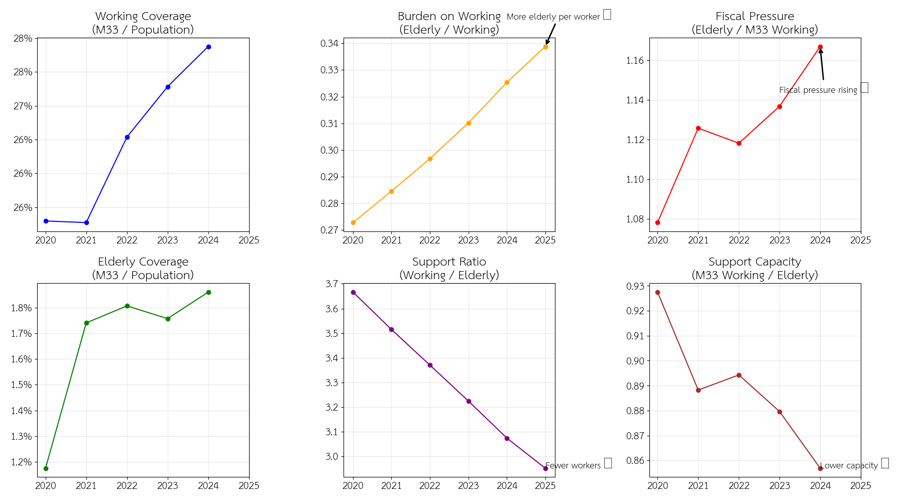
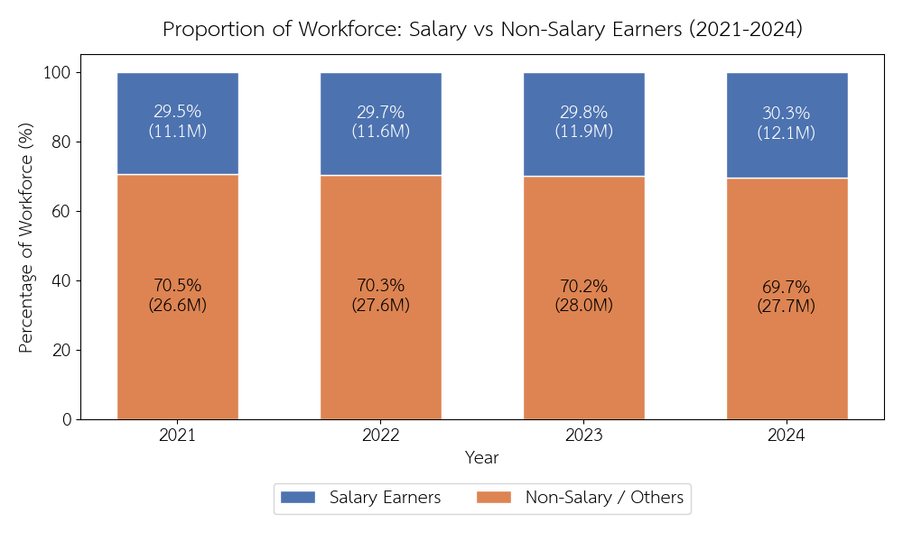
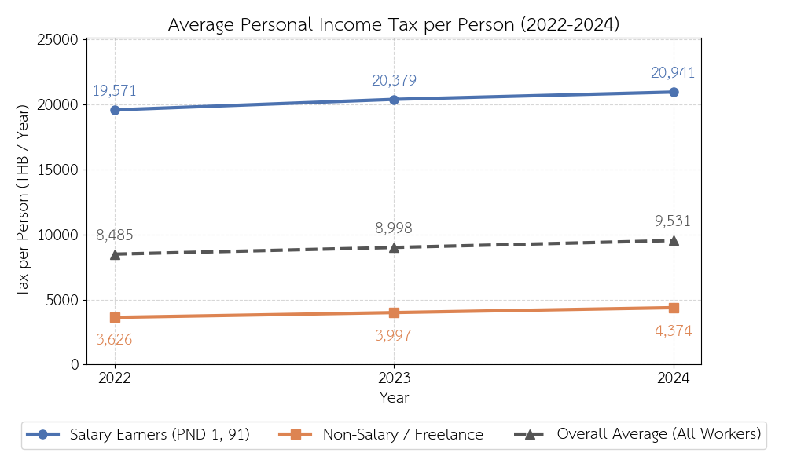
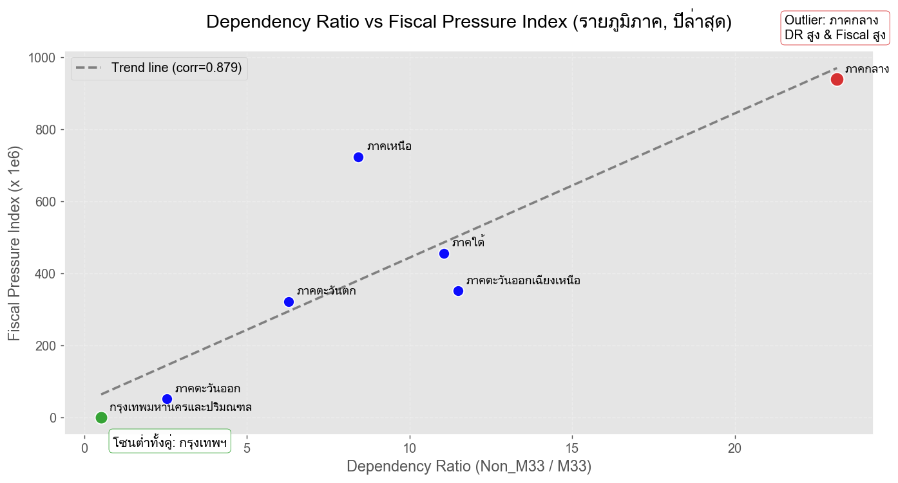

# บทวิเคราะห์ผลการศึกษา: โครงสร้างภาษีของประเทศไทย - ใครคือผู้แบกรับภาระที่แท้จริง?

ทุกการขับเคลื่อนของประเทศล้วนต้องอาศัยงบประมาณจาก "ภาษี" ไม่ว่าจะเป็นการบริโภคที่ขับเคลื่อนผ่านภาษีมูลค่าเพิ่ม (VAT) หรือการดำเนินธุรกิจที่ขับเคลื่อนผ่านภาษีเงินได้นิติบุคคล (CIT) อย่างไรก็ตาม คำถามสำคัญในเชิงเศรษฐศาสตร์การเมืองและโครงสร้างสังคมคือ **"ใครคือกลุ่มคนที่กำลังแบกรับรายได้หลักของประเทศนี้อยู่อย่างแท้จริง?"**

รายงานการวิเคราะห์ฉบับนี้ มุ่งเน้นไปที่การเจาะลึกข้อมูลการจัดเก็บภาษีของกรมสรรพากร เพื่อทำความเข้าใจ **ภาระภาษี (Tax Burden)** ที่เกิดขึ้นจริงในระบบเศรษฐกิจไทย โดยอ้างอิงจากการวิเคราะห์ชุดข้อมูลเชิงสถิติ

---

## กรอบการวิเคราะห์และนิยามตัวชี้วัด

เพื่อให้การตีความผลการศึกษาเป็นไปอย่างสอดคล้องกันตลอดทั้งบทวิเคราะห์ กำหนดตัวชี้วัดหลักไว้ดังนี้

1. **PIT (Personal Income Tax)** = ภาษีเงินได้บุคคลธรรมดา
2. **Dependency Ratio ที่ใช้** = `Non_M33 / M33`
   - ค่าที่สูงขึ้นสะท้อนสัดส่วน `Non_M33` ที่มากเมื่อเทียบกับ `M33` ในระดับภูมิภาค (ในชุดข้อมูลนี้มักถูกตีความเป็นภาระพึ่งพิงต่อฐานผู้ประกันตน ม.33)
3. **Fiscal Pressure Index** = `Non_M33^2 / (Employed × PIT)`
   - ค่าที่สูงขึ้นสะท้อนว่าภาระจากกลุ่ม `Non_M33` หนุนให้แรงกดดันสูง ขณะที่ฐานกำลังแรงงานและรายได้จาก PIT ที่รองรับแรงกดดันมีบทบาทลดทอน
4. **Tax per dependent (proxy ความยั่งยืนเชิงอายุ)** = `PIT / Non_M33`
   - ใช้เพื่อพิจารณาว่าภาระพึ่งพิง (จาก `Non_M33`) ที่เพิ่มขึ้น ถูก “รองรับ” ด้วยรายได้จาก PIT ได้มากน้อยเพียงใด

---

## 1) ภาพรวมโครงสร้างรายได้ภาษี

เมื่อมองจากข้อมูลภาพรวม โครงสร้างการจัดเก็บภาษีของประเทศไทยแสดงให้เห็นถึงสัดส่วนดังต่อไปนี้:

- **อันดับ 1: ภาษีเงินได้นิติบุคคล (Corporate Income Tax - CIT)** มีสัดส่วนสูงที่สุด
- **อันดับ 2: ภาษีมูลค่าเพิ่ม (Value Added Tax - VAT)**
- **อันดับ 3: ภาษีเงินได้บุคคลธรรมดา (Personal Income Tax - PIT)**

จากตัวเลขในระดับนี้ อาจทำให้เกิดข้อสรุปในเบื้องต้นว่า ภาครัฐพึ่งพารายได้จาก "ภาคธุรกิจและการบริโภค" เป็นหลัก แต่เมื่อทำการเจาะลึกลงไปในโครงสร้างของภาษีบุคคลธรรมดา ข้อเท็จจริงกลับแสดงให้เห็นภาพที่แตกต่างออกไป

---

## 2) PIT: สรุปปลายปี vs. หัก ณ ที่จ่าย (form_code)

เมื่อวิเคราะห์ที่มาของรายได้ในหมวดภาษีเงินได้บุคคลธรรมดา พบว่ากลไกการจัดเก็บที่สร้างรายได้หลักให้กับรัฐ ไม่ใช่ขั้นตอนการยื่นภาษีประจำปีที่ทุกคนคุ้นเคย แต่คือการจัดเก็บจากต้นทาง

| ประเภทการยื่นภาษี | รูปแบบการจัดเก็บ | ความสำคัญต่อรายได้รัฐ |
| :--- | :--- | :--- |
| **ภ.ง.ด.1** | หัก ณ ที่จ่ายจากเงินเดือน (ทุกเดือน) | คิดเป็นสัดส่วนมากกว่า **64%** ของรายได้ภาษีบุคคลทั้งหมด |
| **ภ.ง.ด.91** | ยื่นแบบแสดงรายการภาษีปลายปี | เป็นเพียงขั้นตอน **การสรุปยอดและปรับปรุงบัญชี (Final Settlement)** |

> **ข้อสังเกตสำคัญ:** ข้อมูลนี้ชี้ให้เห็นว่า "กลุ่มมนุษย์เงินเดือน" คือกลุ่มผู้เสียภาษีที่ "จ่ายจริง" และ "จ่ายก่อน" โดยไม่มีช่องว่างทางเวลาหรือโอกาสในการบริหารจัดการเพื่อชะลอการจ่ายภาษี

---

## 3) โครงสร้างประชากรและแนวโน้มวัยทำงาน (ปี 2020–2025)

- **วัยเด็ก (0–15 ปี):** มีแนวโน้มหดตัวลงอย่างต่อเนื่อง โดยลดลงจาก 16.5% ในปี 2020 เหลือเพียง 14.3% ในปี 2025 บ่งชี้ถึงอัตราการเกิดใหม่ที่ลดน้อยลง
- **วัยทำงาน (15–59 ปี):** สัดส่วนของประชากรวัยทำงาน (15–59 ปี) ค่อยๆ หดตัวลงทุกปี โดยลดจากจุดสูงสุดในกราฟที่ 65.6% ในปี 2020 ลงมาอยู่ที่ 64.0% ในปี 2025
- **วัยสูงอายุ (60+ ปี):** เป็นกลุ่มเดียวที่มีสัดส่วนเพิ่มขึ้นอย่างต่อเนื่องทุกปี โดยขยายตัวจาก 17.9% ในปี 2020 ไปแตะระดับ 21.7% ในปี 2025

ข้อมูลชุดนี้ยืนยันว่า โครงสร้างประชากรไทยกำลังเผชิญกับ **ภาวะหดตัวของฐานวัยแรงงาน** ควบคู่ไปกับ **การพุ่งสูงขึ้นของวัยเกษียณ** ปรากฏการณ์ดังกล่าวส่งผลโดยตรงต่อ อัตราส่วนภาระพึ่งพิง (Dependency Ratio) ที่สูงขึ้น หมายความว่าประชากรวัยทำงานที่น้อยลงจะต้องแบกรับภาระในการดูแลผู้สูงอายุที่มีจำนวนมากขึ้น แนวโน้มนี้อาจนำไปสู่ความท้าทายทางเศรษฐกิจ เช่น ปัญหาขาดแคลนแรงงาน ภาระด้านงบประมาณสาธารณสุขและสวัสดิการที่เพิ่มสูงขึ้น

---
## 4) แรงกดดันด้านการคลังภายใต้โครงสร้างประชากร

เมื่อเวลาผ่านไป คนทำงาน 1 คนต้องดูแลผู้สูงอายุมากขึ้นกว่าเดิม ขณะที่จำนวนผู้ที่จ่ายเงินเข้าสู่ระบบ ไม่ได้เติบโตในอัตราเดียวกัน  
ผลลัพธ์คือ **แรงกดดันทางการคลัง (Fiscal Pressure)** ที่ค่อย ๆ สะสม และเริ่มสะท้อนชัดผ่านตัวชี้วัดสำคัญ เช่น **Fiscal Pressure ที่เพิ่มขึ้น** และ **Support Capacity ที่ลดลง**

สรุปเชิงกลไก:

> เมื่อสัดส่วนผู้พึ่งพิงเพิ่มขึ้น ขณะที่กำลังแรงงานในระบบไม่เติบโตสอดคล้อง แรงกดดันทางการคลังจึงมีแนวโน้มสะสม

นัยเชิงนโยบายจึงควรเปลี่ยนจากการตั้งคำถามเกี่ยวกับการเข้าสู่สังคมสูงวัย ไปสู่การประเมินความยั่งยืนของระบบภาษีและการคลังภายใต้แรงกดดันจากโครงสร้างประชากรและข้อจำกัดด้านกำลังแรงงาน

หากไม่มีการปรับตัวเชิงนโยบาย ไม่ว่าจะเป็น  
- การขยายฐานแรงงาน  
- การปรับอายุเกษียณ  
- หรือการออกแบบระบบสวัสดิการใหม่  

โครงสร้างประชากรที่กำลังเปลี่ยนไปในวันนี้  
อาจกลายเป็น **ข้อจำกัดทางการคลังของประเทศในอนาคตอย่างหลีกเลี่ยงไม่ได้**

---
## 5) โครงสร้างแรงงาน: ฐานผู้เสียภาษีและความสามารถในการจัดเก็บ

กราฟนี้แสดงสัดส่วนของแรงงานระหว่าง **กลุ่มมนุษย์เงินเดือน (Salary Earners)** และ **กลุ่มนอกระบบ/อิสระ (Non-salary / Others)** ในช่วงปี 2021–2024 ซึ่งสะท้อนโครงสร้างพื้นฐานของฐานภาษีในประเทศ

- **ภาพรวม:**  
  แรงงานส่วนใหญ่ของประเทศอยู่ในกลุ่มนอกระบบ โดยมีสัดส่วนประมาณ **70%** ในทุกปี ขณะที่แรงงานในระบบ (มนุษย์เงินเดือน) มีเพียงประมาณ **30%** เท่านั้น

- **แนวโน้ม:**  
  สัดส่วนของแรงงานในระบบมีการเพิ่มขึ้นเล็กน้อยจาก **29.5% ในปี 2021** เป็น **30.3% ในปี 2024** แต่การเปลี่ยนแปลงดังกล่าวยังอยู่ในระดับจำกัด และไม่เพียงพอที่จะเปลี่ยนโครงสร้างโดยรวม

- **เชิงปริมาณ:**  
  แม้จำนวนแรงงานในระบบจะเพิ่มขึ้นจากประมาณ **11.1 ล้านคน → 12.1 ล้านคน** แต่แรงงานนอกระบบยังคงเป็นกลุ่มหลักของประเทศที่มีจำนวนมากกว่าอย่างมีนัยสำคัญ

---

### Insight สำคัญ

> โครงสร้างแรงงานของประเทศไทยมีลักษณะ “แรงงานส่วนใหญ่อยู่นอกระบบ แต่รายได้ภาษีกลับพึ่งพาแรงงานในระบบเป็นหลัก”

กล่าวคือ แม้แรงงานนอกระบบจะเป็นกลุ่มใหญ่ของประเทศ แต่กลับไม่ได้เป็นฐานภาษีหลักของรัฐ ในขณะที่แรงงานในระบบซึ่งมีสัดส่วนเพียงประมาณ 1 ใน 3 กลับเป็นกลุ่มที่ถูกจัดเก็บภาษีได้อย่างมีประสิทธิภาพมากที่สุด

- ระบบภาษีมีลักษณะ **พึ่งพากลุ่มแรงงานขนาดเล็ก**
- ฐานภาษีของประเทศ **ไม่ได้สอดคล้องกับโครงสร้างแรงงานจริง**
- ความเสี่ยงในระยะยาวคือ:
  - หากจำนวนแรงงานในระบบไม่เพิ่ม → ฐานภาษีจะไม่ขยาย
  - ขณะที่ภาระของรัฐ (จากผู้สูงอายุ) เพิ่มขึ้นต่อเนื่อง

---
## 6) ภาษีต่อหัว: ใครแบกรับภาระมากที่สุด?

กราฟนี้แสดงค่าเฉลี่ยภาษีเงินได้บุคคลธรรมดาต่อคน (Personal Income Tax per Person) ระหว่างปี 2022–2024 โดยเปรียบเทียบระหว่าง **กลุ่มมนุษย์เงินเดือน (Salary Earners)** และ **กลุ่มแรงงานนอกระบบ/อิสระ (Non-salary / Freelance)**

- **ภาพรวม:**  
  กลุ่มมนุษย์เงินเดือนมีภาระภาษีต่อหัวสูงกว่ากลุ่มอื่นอย่างชัดเจน โดยอยู่ที่ประมาณ **19,571 → 20,941 บาท/ปี** ขณะที่กลุ่มนอกระบบอยู่ที่เพียง **3,626 → 4,374 บาท/ปี**

- **ความแตกต่าง:**  
  มนุษย์เงินเดือนจ่ายภาษีมากกว่าประมาณ **4–5 เท่า** เมื่อเทียบกับแรงงานนอกระบบ สะท้อนถึงความแตกต่างของภาระภาษีในแต่ละกลุ่มอย่างมีนัยสำคัญ

- **แนวโน้ม:**  
  ภาษีต่อหัวมีแนวโน้มเพิ่มขึ้นในทุกกลุ่ม แต่ **ช่องว่างระหว่างกลุ่มยังคงอยู่** และไม่ได้ลดลง

- **ค่าเฉลี่ยรวม:**  
  ค่าเฉลี่ยของทั้งระบบอยู่ที่ประมาณ **8,485 → 9,531 บาท/ปี** ซึ่งสะท้อนว่าค่าเฉลี่ยถูก “ดึงขึ้น” โดยกลุ่มมนุษย์เงินเดือน

---

> แม้แรงงานนอกระบบจะเป็นคนส่วนใหญ่ของประเทศ แต่ภาระภาษีต่อหัวกลับกระจุกตัวอยู่ที่กลุ่มมนุษย์เงินเดือนอย่างชัดเจน

กล่าวคือ ระบบภาษีไม่ได้กระจายภาระตามจำนวนประชากร แต่กระจุกตัวอยู่ในกลุ่มที่สามารถจัดเก็บภาษีได้ง่ายและมีประสิทธิภาพมากที่สุด

---

## 7) ข้อสรุปเชิงภาพรวมของผลการวิเคราะห์

เมื่อพิจารณาข้อมูลทั้งหมด ประเด็นสำคัญเชิงโครงสร้างไม่ได้อยู่ที่ “กลุ่มใดมีรายได้สูงที่สุด” แต่สะท้อนว่าระบบภาษีสามารถเข้าถึงรายได้ของกลุ่มต่าง ๆ ได้ง่ายเพียงใด ในกรอบข้อมูลนี้ กลไกการหัก ณ ที่จ่ายสำหรับผู้มีรายได้จากการทำงานประจำ ทำให้ภาระภาษีของ PIT มีแนวโน้มกระจุกตัวในกลุ่มคนทำงานรับเงินเดือนมากกว่ากลุ่มที่อยู่นอกระบบ

---
## 8) ความแตกต่างเชิงภูมิภาค: ภาระพึ่งพิง (Dependency Ratio) สูง-ต่ำกระจุกตัว

อัตราส่วนภาระพึ่งพิงของประเทศไทยมีแนวโน้มลดลงเล็กน้อยอย่างต่อเนื่อง โดยลดลงจาก `4.84` ในปี `2020` เหลือ `4.36` ในปี `2024` สะท้อนว่าภาระที่ประชากรวัยทำงานต้องแบกรับมีการผ่อนคลายลงในภาพรวม แต่ยังคงอยู่ในระดับที่ค่อนข้างสูง

แม้ภาพรวมจะดู “ดีขึ้นเล็กน้อย” แต่เมื่อแยกตามภูมิภาคกลับพบ **ความเหลื่อมล้ำของภาระพึ่งพิงอย่างชัดเจน**:

- ภาพรวมทั้งประเทศ: ค่า `Dependency Ratio` ค่อยๆ ลดลงจาก `4.84 → 4.36` ในช่วง `2020–2024`
  (แสดงถึงแนวโน้มภาระพึ่งพิงลดลงเล็กน้อย แต่ยังไม่ใช่การเปลี่ยนแปลงเชิงโครงสร้างที่ชัดเจน)
- กรุงเทพมหานครและปริมณฑล: ค่าเพียง `0.52` ซึ่งต่ำที่สุดในประเทศ
  สะท้อนถึงการเป็นศูนย์กลางเศรษฐกิจที่มีสัดส่วนประชากรวัยทำงานสูงและภาระพึ่งพิงต่ำ
- ภาคตะวันออก: มีค่า `2.55` อยู่ในระดับต่ำ
  สะท้อนถึงโครงสร้างประชากรที่ยังเอื้อต่อการขับเคลื่อนเศรษฐกิจและภาคอุตสาหกรรม
- ภาคตะวันตกและภาคเหนือ: มีค่า `6.29` และ `8.43` ตามลำดับ
  เริ่มเห็นสัญญาณของภาระพึ่งพิงที่เพิ่มขึ้นจากโครงสร้างประชากรที่กำลังเปลี่ยนไป
- ภาคใต้และภาคตะวันออกเฉียงเหนือ: มีค่า `11.06` และ `11.49` ซึ่งอยู่ในระดับค่อนข้างสูง
  สะท้อนถึงจำนวนประชากรพึ่งพิงที่เพิ่มขึ้นเมื่อเทียบกับแรงงานในพื้นที่
- ภาคกลาง: มีค่าสูงที่สุดที่ `23.14`
  แสดงถึงภาระพึ่งพิงที่สูงผิดปกติ และอาจสะท้อนความไม่สมดุลของโครงสร้างประชากรในภูมิภาค

ข้อมูลชุดนี้ยืนยันว่า แม้อัตราส่วนภาระพึ่งพิงของประเทศไทยในภาพรวมจะมีแนวโน้มลดลงเล็กน้อย แต่ในระดับพื้นที่กลับเกิด **ความเหลื่อมล้ำของภาระพึ่งพิงอย่างชัดเจน** โดยบางภูมิภาคมีแรงงานหนาแน่นและภาระต่ำ ขณะที่บางพื้นที่ต้องเผชิญกับภาระที่สูงมาก

แนวโน้มดังกล่าวอาจนำไปสู่ความท้าทายทางเศรษฐกิจ เช่น การกระจายตัวของแรงงานที่ไม่สมดุล ภาระด้านสวัสดิการในบางพื้นที่ที่เพิ่มสูงขึ้น และความเสี่ยงต่อ productivity ในระยะยาว

---
## 9) ความสัมพันธ์ระหว่างภาระพึ่งพิงและแรงกดดันทางการคลัง

เพื่อทำความเข้าใจว่า ภาระพึ่งพิงส่งผลต่อภาระทางการคลังอย่างไร ได้มีการวิเคราะห์ความสัมพันธ์ระหว่าง Dependency Ratio และ Fiscal Pressure Index ในระดับภูมิภาค

กราฟ Scatter Plot เชื่อมความสัมพันธ์ระหว่าง **อัตราส่วนภาระพึ่งพิง (Dependency Ratio)** และ **ดัชนีแรงกดดันทางการคลัง (Fiscal Pressure Index)** ในระดับภูมิภาค เพื่อสะท้อนให้เห็นว่า “โครงสร้างประชากร” แปลผลออกมาเป็น “ภาระที่รัฐต้องรองรับ” ในเชิงเศรษฐกิจได้อย่างไร

ภาพรวมเชิงโครงสร้าง: พบความสัมพันธ์ **เชิงบวกอย่างชัดเจน** ระหว่าง Dependency Ratio และ Fiscal Pressure Index โดยมี `correlation = 0.879` ซึ่งหมายความว่า ภูมิภาคที่มีประชากรพึ่งพิงสูง มักมีแนวโน้มเผชิญแรงกดดันทางการคลังสูงตามไปด้วย สะท้อนภาระที่ตกอยู่กับประชากรวัยทำงานในพื้นที่นั้นโดยตรง

เพื่อให้ตีความเชิงนโยบายได้ง่าย จึงแบ่งกลุ่มภูมิภาคตามระดับของ “ภาระพึ่งพิง” และ “แรงกดดันทางการคลัง” ดังนี้

- กลุ่มภาระต่ำ (Low Dependency - Low Fiscal Pressure):
  กรุงเทพมหานครและปริมณฑลอยู่ในตำแหน่งที่มีค่าต่ำทั้งสองตัวแปร แสดงถึงโครงสร้างประชากรที่มีสัดส่วนแรงงานสูง และศักยภาพทางเศรษฐกิจที่สามารถรองรับภาระของรัฐได้ดี

- กลุ่มภาระปานกลาง:
  ภาคตะวันออก ภาคตะวันตก และบางส่วนของภาคเหนือ อยู่ในระดับกลางของกราฟ สะท้อนถึงโครงสร้างที่ยังพอรองรับภาระได้ แต่เริ่มมีสัญญาณของแรงกดดันที่เพิ่มขึ้น

- กลุ่มภาระสูง (High Dependency - High Fiscal Pressure):
  ภาคใต้ ภาคตะวันออกเฉียงเหนือ และภาคเหนือ มีค่าอยู่ในระดับค่อนข้างสูง สะท้อนถึงจำนวนประชากรพึ่งพิงที่เพิ่มขึ้นเมื่อเทียบกับแรงงานในพื้นที่ ส่งผลให้ภาระของรัฐและแรงงานในพื้นที่สูงขึ้นอย่างมีนัยสำคัญ

Outlier สำคัญ - ภาคกลาง:
ภาคกลางมีค่า Dependency Ratio และ Fiscal Pressure Index สูงที่สุดอย่างโดดเด่นเมื่อเทียบกับภูมิภาคอื่น ซึ่งสะท้อนความไม่สมดุลของโครงสร้างประชากรและแรงกดดันทางการคลังที่รุนแรงกว่าพื้นที่อื่น

ข้อมูลชุดนี้ยืนยันว่า ภาระของระบบเศรษฐกิจไทยไม่ได้กระจายอย่างเท่าเทียม แต่มีลักษณะเป็น **ความเหลื่อมล้ำเชิงพื้นที่** โดยภูมิภาคที่มีสัดส่วนประชากรพึ่งพิงสูงกำลังเผชิญแรงกดดันทางการคลังที่สูงขึ้น ขณะที่พื้นที่เศรษฐกิจหลักยังคงมีความสามารถในการรองรับภาระได้ดีกว่า

ปรากฏการณ์ดังกล่าวชี้ให้เห็นว่า “ผู้แบกรับภาระที่แท้จริง” ไม่ได้เป็นเพียงกลุ่มแรงงานในภาพรวมของประเทศ แต่คือแรงงานในบางพื้นที่ที่ต้องรองรับทั้งภาระทางประชากรและภาระทางการคลังในระดับที่สูงกว่าค่าเฉลี่ยอย่างมีนัยสำคัญ

---
## 10) ความแตกต่างเชิงภูมิภาคของภาระทางการคลัง (Fiscal Pressure Index)

ดัชนีภาระทางการคลัง (Fiscal Pressure Index) สะท้อนถึง “ภาระที่รัฐต้องแบกรับ” จากประชากรพึ่งพิง เมื่อเทียบกับกำลังแรงงานและศักยภาพทางเศรษฐกิจในแต่ละพื้นที่ โดยในปี 2024 พบว่าค่า Fiscal Pressure Index มี **ความแตกต่างอย่างชัดเจนในแต่ละภูมิภาค** ซึ่งชี้ให้เห็นความไม่สมดุลของโครงสร้างประชากรและความสามารถในการรองรับภาระของระบบเศรษฐกิจท้องถิ่น

- **ภาพรวมเชิงโครงสร้าง:** ค่า Fiscal Pressure Index มีความสัมพันธ์โดยตรงกับ Dependency Ratio กล่าวคือ พื้นที่ที่มีประชากรพึ่งพิงสูงและแรงงานไม่เพียงพอ จะมีภาระทางการคลังสูงตามไปด้วย

เมื่อพิจารณาเป็นรายภูมิภาค:

- **กรุงเทพมหานครและปริมณฑล:** มีค่าต่ำที่สุดที่ `0.000001` สะท้อนถึงฐานแรงงานที่แข็งแรง และศักยภาพในการรองรับภาระของรัฐที่สูง
- **ภาคตะวันออก:** มีค่า `0.000052` อยู่ในระดับต่ำ แสดงถึงโครงสร้างเศรษฐกิจที่ยังสามารถรองรับภาระพึ่งพิงได้ดี
- **ภาคตะวันตกและภาคตะวันออกเฉียงเหนือ:** มีค่า `0.000322` และ `0.000352` ตามลำดับ เริ่มสะท้อนแรงกดดันทางการคลังที่เพิ่มขึ้นจากจำนวนประชากรพึ่งพิง
- **ภาคใต้:** มีค่า `0.000456` อยู่ในระดับค่อนข้างสูง แสดงถึงภาระที่รัฐต้องรองรับเพิ่มขึ้นจากโครงสร้างประชากร
- **ภาคเหนือ:** มีค่า `0.000724` สะท้อนถึงแรงกดดันทางการคลังที่สูงขึ้นอย่างมีนัยสำคัญ
- **ภาคกลาง:** มีค่าสูงที่สุดที่ `0.000938` แสดงถึงภาระทางการคลังที่สูงที่สุดในประเทศ และสอดคล้องกับระดับ Dependency Ratio ที่สูงผิดปกติในพื้นที่เดียวกัน

ข้อมูลชุดนี้ยืนยันว่า ภาระทางการคลังของประเทศไทยไม่ได้กระจายอย่างเท่าเทียมกัน แต่มีลักษณะเป็น **ความเหลื่อมล้ำเชิงพื้นที่** โดยบางภูมิภาคมีความสามารถในการรองรับภาระได้ดี ขณะที่บางพื้นที่กำลังเผชิญกับแรงกดดันที่สูงขึ้นอย่างต่อเนื่อง

แนวโน้มดังกล่าวอาจนำไปสู่ความท้าทายด้านนโยบายการคลัง เช่น การจัดสรรงบประมาณ การบริหารสวัสดิการ และความยั่งยืนของระบบการเงินภาครัฐในระยะยาว

---
## 11) ข้อเสนอแนะเชิงนโยบายและข้อจำกัดของการศึกษา

จากผลการวิเคราะห์ในกรอบข้อมูลนี้ พบว่า “ภาระภาษี/PIT” และ “แรงกดดันทางการคลัง” มีความเชื่อมโยงกับโครงสร้างประชากรและโครงสร้างฐานผู้เสียภาษีในระดับภูมิภาค โดยเฉพาะกลุ่มที่มี `Dependency Ratio` สูงและมี `Fiscal Pressure Index` สูง

ข้อเสนอแนะเชิงนโยบายที่สอดคล้องกับผลการศึกษา ได้แก่
- จัดลำดับความสำคัญของนโยบายไปยังภูมิภาคที่มี `Dependency Ratio` และ `Fiscal Pressure Index` สูง (โดยผลในชุดข้อมูลชี้ให้เห็นบทบาทสำคัญของภาคกลาง) ผ่านมาตรการขยายฐานแรงงานและเพิ่มความต่อเนื่องของรายได้จากระบบภาษีเงินได้บุคคลธรรมดา
- เสริมความสามารถในการรองรับภาระระยะยาวด้วยนโยบายเพิ่มการมีส่วนร่วมของแรงงานในระบบ และการยกระดับความครอบคลุม/ความสามารถในการจัดเก็บภาษีสำหรับผู้มีรายได้ที่เข้าถึงได้ยากกว่ากลุ่มประกันสังคม
- วางมาตรการสำหรับช่วงก่อนเข้าสู่วัยสูงอายุเพื่อชะลอการลดลงของ `Tax per dependent` และลดความเสี่ยงด้านความยั่งยืนทางการคลังในอนาคต
- ใช้กรุงเทพมหานครและปริมณฑลเป็น benchmark ของโครงสร้างรายได้ PIT ต่อผู้ประกันตน เพื่อออกแบบแนวทางยกระดับในภูมิภาคที่ยังมีความสามารถในการรองรับต่ำกว่า

ข้อจำกัดของการศึกษา: การตีความผลลัพธ์ขึ้นอยู่กับนิยามของตัวชี้วัดในกรอบข้อมูลนี้ (เช่น `Non_M33 / M33` และสูตร `Non_M33^2 / (Employed × PIT)`) ดังนั้นการนำไปใช้ควรตรวจสอบความสอดคล้องของนิยามและความครอบคลุมของข้อมูลในระดับพื้นที่เพิ่มเติม
